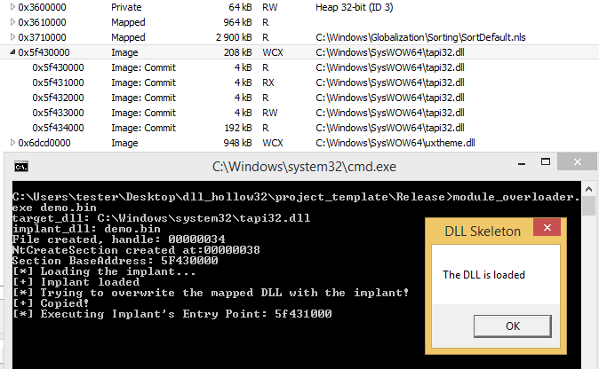

# Module Overloading

A PoC based on the idea of [thewover](https://github.com/thewover) (twitter [@TheRealWover](https://twitter.com/TheRealWover)):
https://twitter.com/TheRealWover/status/1193284444687392768?s=20

Using: [libpeconv](https://github.com/hasherezade/libpeconv).

Clone:
-
Use recursive clone to get the repo together with all the submodules:
<pre>
git clone --recursive https://github.com/hasherezade/module_overloading.git
</pre>

